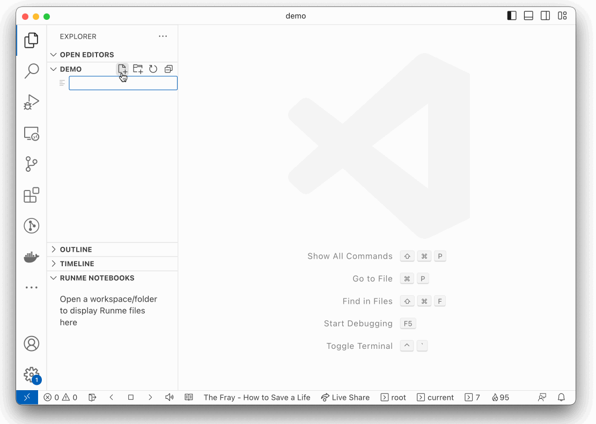

[](https://runme.dev)

# Runme runs Markdown [](https://github.com/stateful/runme/actions/workflows/ci.yml) [](https://discord.gg/runme)

> Discover and run code snippets directly from your markdown files, e.g. runbooks, docs, or READMEs (defaults to local `README.md`).

[Runme](https://runme.dev) is a tool that makes runbooks actually runnable, making it easier to follow step-by-step instructions. Shell/bash, Python, Ruby, Javascript/Typescript, Lua, PHP, Perl, and many other runtimes are supported via Runme's shebang feature. Runme allows users to execute instructions, check intermediate results, and ensure the desired outputs are achieved. This makes it an excellent solution for runbooks, playbooks, and documentation that requires users to complete runnable steps incrementally—making operational docs reliable and much less susceptible to bitrot.

Runme achieves this by literally running markdown. More specifically, Runme runs your commands (shell, bash, zsh) or code inside your fenced code blocks. It's 100% compatible with your programming language's task definitions (Makefile, Gradle, Grunt, NPM scripts, Pipfile or Deno tasks, etc.) and markdown-native. Much like a terminal session, environment variables are retained across execution, and it is possible to pipe previous cells's output into successive cells. Runme persists your runbooks in markdown, which your docs are likely already using.

<p align="center">
  
</p>

Watch full video at [Runme](https://runme.dev).

## Installation

To get started with Runme on MacOS, the recommended method of installation is using Homebrew, a popular package manager that simplifies the installation process. First, ensure your Homebrew is up to date to avoid any compatibility issues:

```sh { name=update-brew }
$ brew update

```

With Homebrew updated, proceed to install Runme. This command will fetch the latest stable release of Runme and install it on your system:

```sh { name=install-runme }
$ brew install runme

```

If you prefer using NPM (Node Package Manager) for managing your packages, Runme can also be installed globally via the following command:

```sh { name=install-npm }
$ npm install -g runme

```

For users with different setups, you can visit [Runme's releases page](https://github.com/stateful/runme/releases) and download a binary suitable for your operating system. For those with Go developer tools set up, Runme can be installed using the `go install` command:

```sh { name=install-via-go }
$ go install github.com/stateful/runme@latest

```

## Commands

Runme’s CLI (Command Line Interface) offers a set of commands designed to help you seamlessly discover and execute workflows within your project. Below are examples demonstrating the use of these commands:

### Run Workflows

Suppose you have a `README.md` file in your project directory with the following content:

````md
# My Project

## Install

To initiate the installation process, start by updating Brew dependencies with the following command:

```sh { name=update-brew }
brew update
...
```

`````

To execute the `update-brew` code cell from the `README.md` file, simply use the runme run command followed by the name of the code cell:

```sh
$ runme run update-brew

```

For more details and advanced configurations for code cells, refer to the [Runme documentation](https://docs.runme.dev/configuration).

### List

To navigate through and identify available workflows in your project, use the `runme list` command. This command will display a list of all workflows you can run:

```sh { name=runme-list closeTerminalOnSuccess=false interactive=false }
$ runme list

```

### Print

The `print` command is useful when you need to review the code within a code cell without executing it. It outputs the code present in the specified code cell, providing a quick way to inspect the code:

```sh { name=runme-print interactive=false }
$ runme print hello-js

```

### Help

Find help and information to parameters and configurations.
If you need assistance or information regarding various parameters and configurations available with Runme, the `help` command provides quick access to helpful information:

```sh { name=runme-help interactive=false }
$ runme help

```

Feel free to explore further and experiment with the commands to get a deeper understanding of Runme’s functionalities!

## Examples

You can find an exhaustive list of examples in the [official Runme documentation](https://runme.dev/examples) with examples demonstrating various use cases of Runme.

## Feedback

Let us know what you think via [GitHub issues](https://github.com/stateful/runme/issues/new) or submit a PR. Join the conversation [on Discord](https://discord.gg/runme). We're looking forward to hear from you.

## Community

The Runme community is growing, join us!

- Ask questions and be curious with us [on Discord](https://discord.gg/runme)
- Read about real live Runme examples and use cases in [our blog](https://runme.dev/blog)
- Subscribe for updates to [our newsletter](https://runme.dev/list)

## Contributing

See [CONTRIBUTING.md](./CONTRIBUTING.md) for more information or just click on:

[](https://runme.dev/api/runme?repository=https%3A%2F%2Fgithub.com%2Fstateful%2Frunme.git&fileToOpen=CONTRIBUTING.md)

## LICENCE

Apache License, Version 2.0
