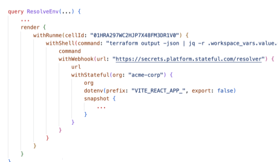
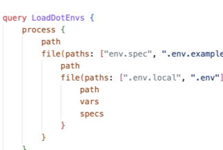

+++
[runme]
id = '01HRA297WC2HJP7X48FM3DR1V0'
version = 'v3'
+++

# The Owl Store 🦉

What is it?

## A ENV solution for Humans **and** Workloads:
- Specify, Validate, and Resolve ENV vars
- Verification of “Correctness” & better tools

## Took inspiration from
- The SSH-Agent
- How Typescript brings type-safety to Javascript

## Why?
- Make idea of “SSO for your Environments” come to live
- The 🦉 knows best, because she's the wisest of birds in the animal kingdom


## Environment “Specs”

The **.env.example** frontend/facade:

```ini {"id":"01HS8C1PN0T7BGJA0T6TT2G68R"}
    JWT_SECRET=Secret to sign authed JWT tokens # Secret!
    ANON_KEY=Secret to sign anonymous JWT tokens # Secret!
    SERVICE_ROLE_KEY=JWT to assume the service role # JWT
    POSTGRES_PASSWORD=Password for the postgres user # Password!
    DASHBOARD_USERNAME=Username for the dashboard # Plain!
    DASHBOARD_PASSWORD=Password for the dashboard # Password!
    SOME_OTHER_VAR=Needs a matching value # Regex(/^[a-z...a. -]+\.)
```

### Philosophy

- Composable, extensible, and progressive
- Queryable resolution thanks to Graph (DAG)
- Use Auth-Context, Machine & Runtime info, etc
- Connect to SOPS, Secret Managers, CLI tools etc
- E.g. different resolution paths per ENV class
- OWL easily better three letter acronym than ENV
- .env files on outside - Graph Engine on inside
- Progressive: use as much or little as you need
- Different facades possible e.g. CRDs, YAML-dialect, SDKs
- Runme’s fallback resolution → “securely prompt user”
- Get involved, help building out owl toolkit & ecosystem

## Anatomy of Environment Vars ⇄ “Specs”


## Extensible at every stage

#### Resolution (e.g. translated env.owl.yaml or JS/Golang/Java/etc SDKs)



#### .env Front-end (query ASTs rendered in text for illustration)



## Common set of Specs (not all available yet)

- Plain

   - Opaque
   - Regex(...)
   - ...

- Secret

   - Password
   - JWT
   - x509Cert
   - ...

- Resources

   - DbUrl
   - Redis
   - ...

- Cred Sets (non-atomic)

   - FirebaseSdk
   - OpenAI
   - ...
