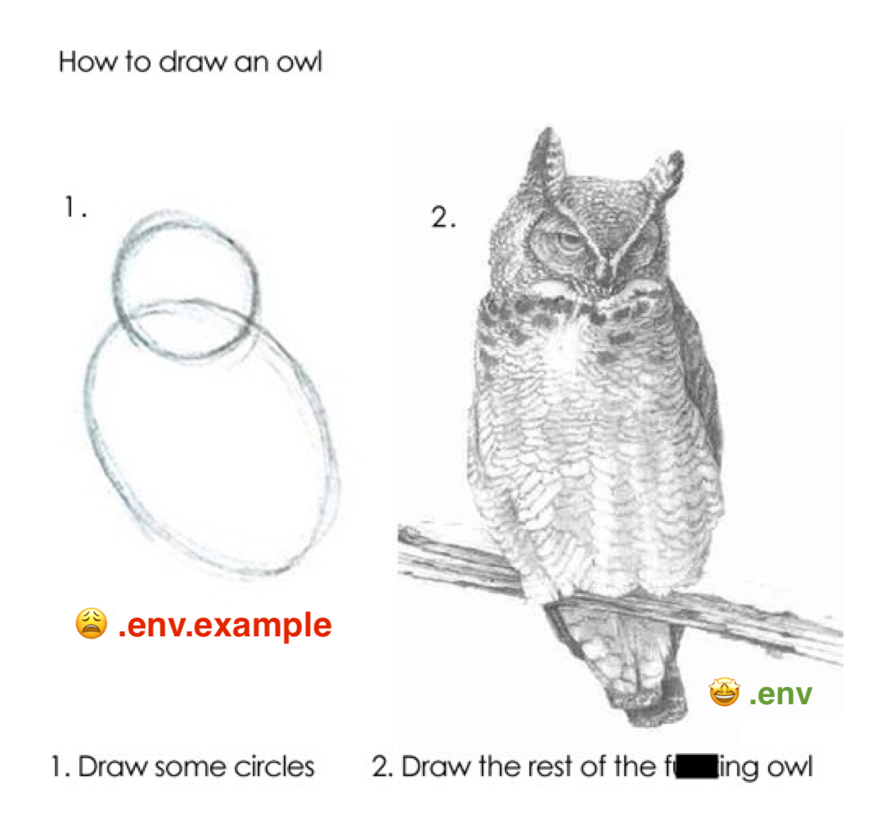

+++
[runme]
id = '01HRA297WC2HJP7X48FM3DR1V0'
version = 'v3'
+++

# The Owl Store 🦉

### ...aka smart ENV store. A better solution to specify, validate, and resolve a user's or workload's environment. Because:

### The owl 🦉 is wise and knows environment variables aren't just for workloads they are for humans, too.
